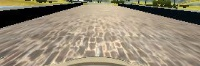
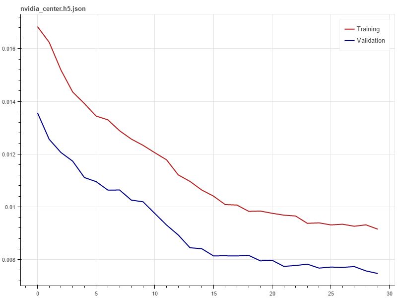
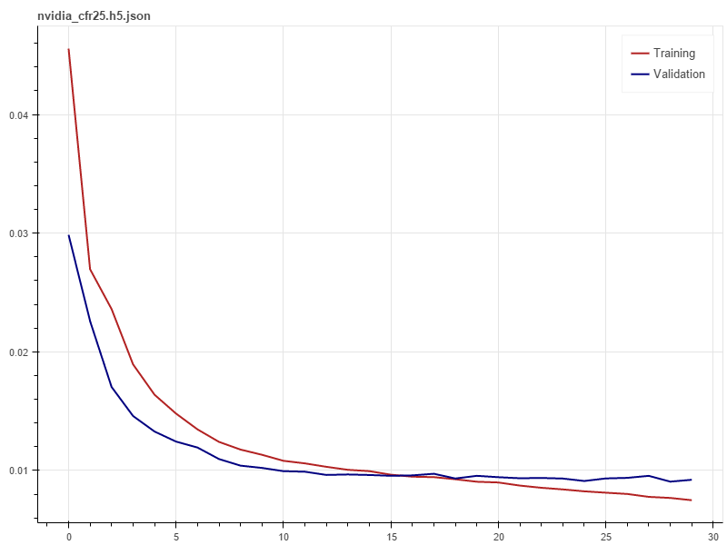
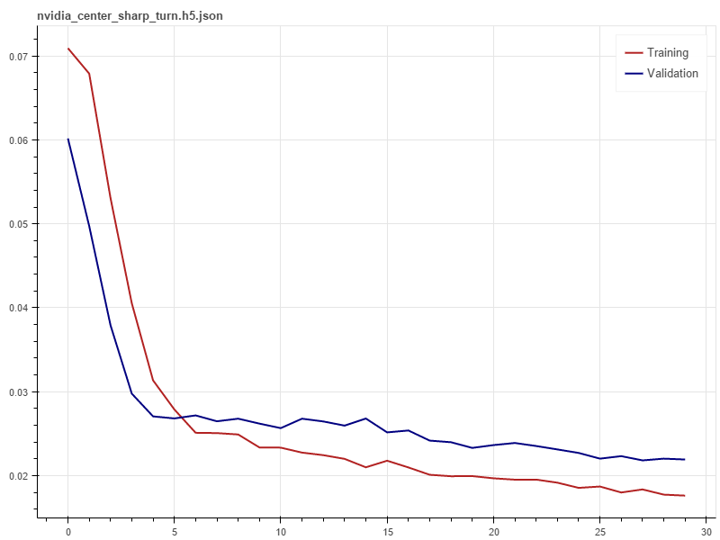
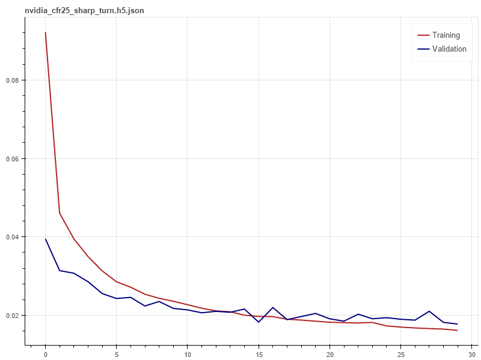

# Behavior-Clone

## Data Gathering
I mainly used Udacity data.

But I also collected my own data and used other people's data as while.

There are the distributions of different data set I used


I used the new simulator with mouse. So I have smooth angles. I drove for many rounds in both forward and backward directions. My data has about 20000 entities.


Udacity's data has about 8000 entities.


This data has about 20000 entities.

Udacity and the other data used old simulator, which is more zero centered.

I also drove many edge recover data and collected some recovery data from other people. But during my experiments, I found that I didn't need many recovery data. So I just used the recovery data from [Somnath Banerjee](https://github.com/cssomnath/udacity-sdc/tree/master/carnd-projects/CarND-Behavioral-Cloning). I considered some of his approach in this [post](https://medium.com/@somnath.banerjee/behavioral-cloning-project-of-self-driving-car-nano-degree-9381aaa4da13).

## Architecture
I tried many different networks. From big networks such as VGG16 plus 2 fully connected layers with 2048 nodes each, to small networks with only 2 convolutions and 2 fully connected layers.

One observation is that a big network, such as VGG, requires much more data to train. And once it's trained, it got overfitted very easily. I used VGG16 with image net weights. I tried 2 approaches, the first one frozed VGG weights and only train the dense layer's weight. The second approach train all layers. Both produce good results. But took too long to train and hard to tune.

Small network is much easy to train, but it's harder to get good results. And once I added recover data, it started to become weird. This made sense because for a human, it's very hard to drive consistantly acrossing different data gathering attempts. Therefore more data introduce more entropy into the system. A small network would have a hardtime to find patterns in such a chaos.

Therefore, I used the Nvidia architecture. This architecture is powerful enough to learn many patterns and in the same time small enough to be trained in a short time.

I tried different variations of Nvidia architectures but I don't find much differences. Therefore, for this report, I used the original nvidia architectures.

The model looks like this
```
learning_rate=0.0001
dropout=0.5
model = Sequential()

model.add(Convolution2D(24, 5, 5, subsample=(2, 2), input_shape=(66, 200, 3),
                        activation='relu'))
model.add(Convolution2D(36, 5, 5, subsample=(2, 2), activation='relu'))
model.add(Convolution2D(48, 5, 5, subsample=(2, 2), activation='relu'))

model.add(Convolution2D(64, 3, 3, activation='relu'))
model.add(Convolution2D(64, 3, 3, activation='relu'))

model.add(Flatten())
model.add(Dropout(dropout))
model.add(Dense(1164, activation='relu'))
model.add(Dropout(dropout))
model.add(Dense(100, activation='relu'))
model.add(Dropout(dropout))
model.add(Dense(50, activation='relu'))
model.add(Dense(10, activation='relu'))
model.add(Dense(1))

opt = Adam(lr=learning_rate)
model.compile(optimizer=opt, loss='mean_squared_error')
```

As you can see, this model, not like VGG, uses subsampling instead of pooling. The dense layer is very standard dense layer. I added 3 dropout layers to reduce the chances of overfitting.

For activation function, I tried Elu and Relu, but the performance are almost the same. Since Relu is easier to compute, I just used Relu.

The remaing sections of this report is all based this architectures in the code.

## Method
I set up 4 comparison groups:
  - Model 1: trained with center images from Udacity's data only
  - Model 2: trained with center images from Udacity'dat and recovery data.
  - Model 3: trained with center, left, right images from Udacity's data only
  - Model 4: trained with center, left, right images from Udacity's data nad recovery data.
  
During my actually experiements, I have many more comparison groups such as different learning rate, different optimizer, different data preprocessing methods. But it will take too many pages to cover all of them. 

For the above 4 comparison groups, I used Adam optimizer with 0.0001 learning rate. No exponential decay. I used adadelta but it took much longer time to converge.

### Data/Image preprocessing
I used all 3 channels. Only 2 preprocessing is done. 

__The first step__ is to crop the upper part of an image because the upper part contains unless information.


This is an original image. As you can see, we probably don't need the sky and environment. We only need the road.


This is the cropped image. Only roads are left.


Then resize the image to 200 width x 66 height for the mdoel to consume. I tried bilinear, bicubic and lanzocs downsampling. The choices of downsampling method doesn't influence the end model result very much, at least not observable by me. In this report, normal bilinear is used.

__The second step__ is to normalize the image. I computed the mean and standard deviation of an image, and subtracted the image by its mean and divided by its std, as shown in the code
```
def normalize(img):
    mean = np.mean(img, axis=(0, 1))
    std = np.std(img, axis=(0, 1))
    return (img - mean) / std

def preprocess_image(img):
    img = imresize(img[60:150, :, :], (200, 66))
    return normalize(img)
```
I also tried a simple linear interpolation which maps value in [0, 255] to [-1.0, 1.0] and/or [-0.5, 0.5]. 

This submission used `(img - mean) / std`.

The choice of normalization doesn't influence end results very much as long as the normalized matrix(image) is zero centered and has a range from [-1, 1]. In practice, linear interpolation should be a better choice because lienar interpolation allows the model to consume unnormalized data during testing because all values are linearly mapped. The std method requires normalization even in the testing time.

In the case of `drive.py`, preprocessing during real time driving delays the system response time.

### Trainning
The trainning is simple, I created 4 models and trained them with different configurations. The validation split is 10 % for all cases. I only trained it for 30 epoch for this report because I noticed that more trainning started to harm the performance (overfitting). Tge angle offset is 0.25. I noticed that the offset can be any number between 0.2 to 0.25. No big difference.
```
create_model('nvidia_center.h5')
train('nvidia_center.h5', batch_size=512, nb_epoch=30, valid_split=0.1, center_only=True, angle=0.25, sharp_turn=False)

create_model('nvidia_center_sharp_turn.h5')
train('nvidia_center_sharp_turn.h5', batch_size=512, nb_epoch=30, valid_split=0.1, center_only=True, angle=0.25, sharp_turn=True)

create_model('nvidia_cfr25_sharp_turn.h5')
train('nvidia_cfr25_sharp_turn.h5', batch_size=512, nb_epoch=30, valid_split=0.1, center_only=False, angle=0.25, sharp_turn=True)

create_model('nvidia_cfr25.h5')
train('nvidia_cfr25.h5', batch_size=512, nb_epoch=30, valid_split=0.1, center_only=False, angle=0.25, sharp_turn=False)
```
You can look at `model.py` for more details.

## Result
### Training History
|               | Center                        | Center Left Right            |
|:-------------:|:-----------------------------:|:----------------------------:|
|No Sharp Turn  |           |           |
| Sharp Turn    |||

### Video

## Discussion and Future Work
As you can see, with Udacity data along , I am able to train a genralized regressor. It still fails in some edge cases. I didn't use random lighting/color adjustment or shifting/rotation to augment the data. But, I believe with more data and data augmentation, the model is powerful enough to learn more patterns.

Also, from a self-driving car point of view, behavior clone approach has a fatal problem. It is only as good as its driver. But human driving are not consistant and stable. Cloning human driving behavior may not be a good way to produce good driving agent. It's a way to produce human like driving agent. However, the goal of self-driving car is to eliminate the dangerous elements in human driving and replace them with well designed and engineered safe, reliable driving.

## Code
Assuming you have your "driving_log.csv" in the `./data` directory, simply run
```
python model.py
```
to build and train the model.

Run
```
python analytic.py
```
to see the analysis.
