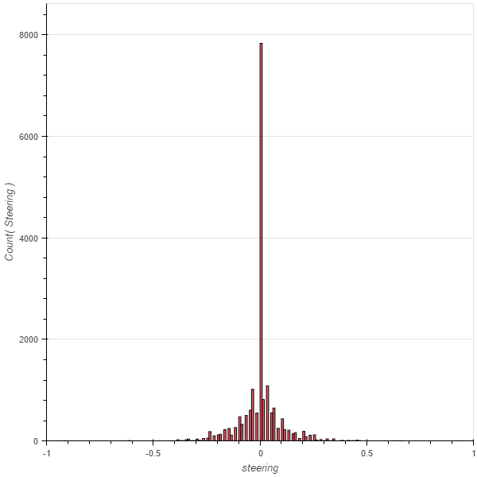
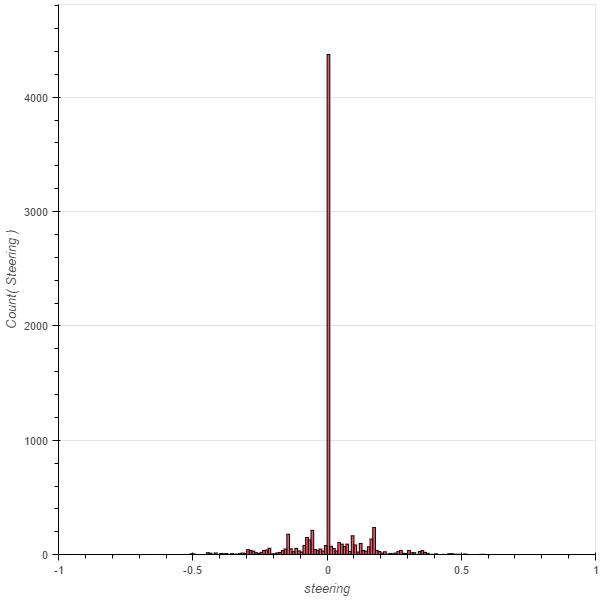
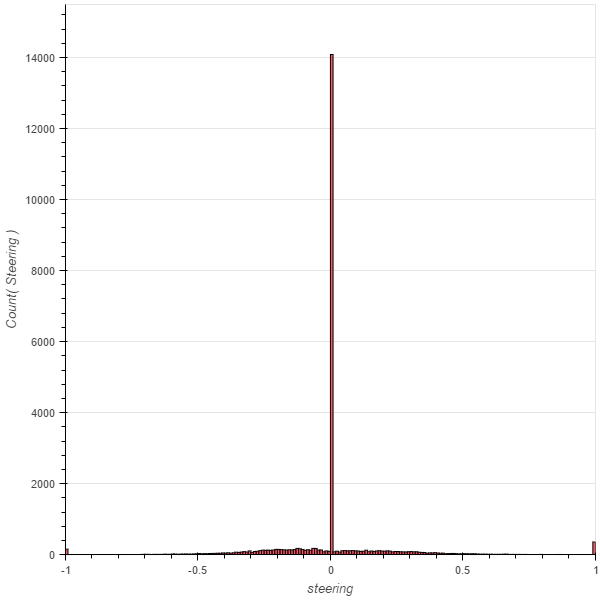

# Behavior-Clone

## Data Gathering
I mainly used Udacity data.

But I also collected my own data and used other people's data as while.

There are the distributions of different data set I used

## Modeling

## Result

## Discussion
